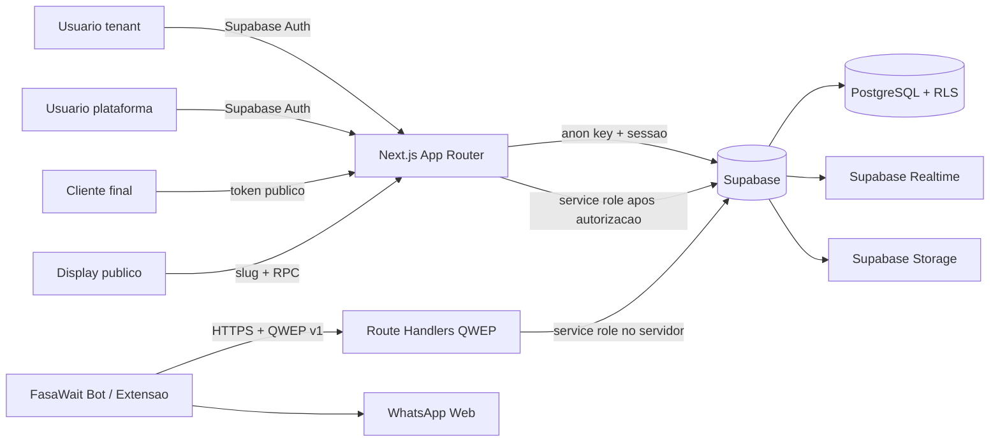
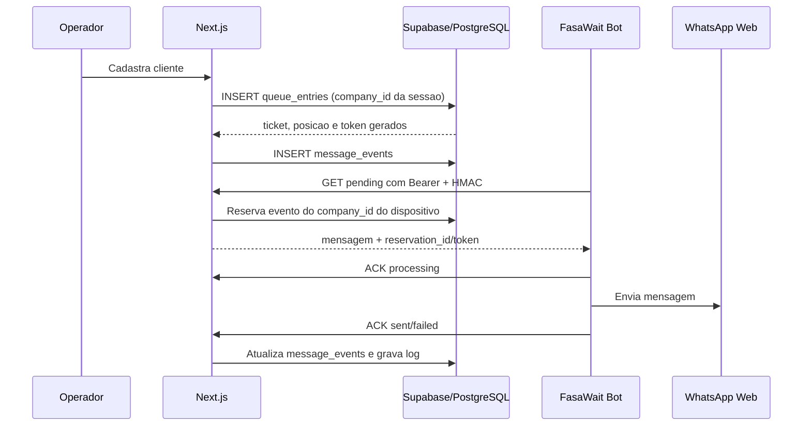
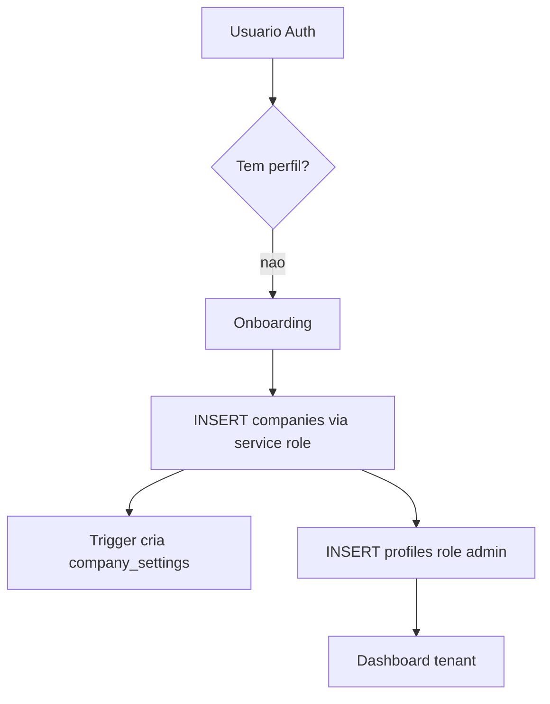
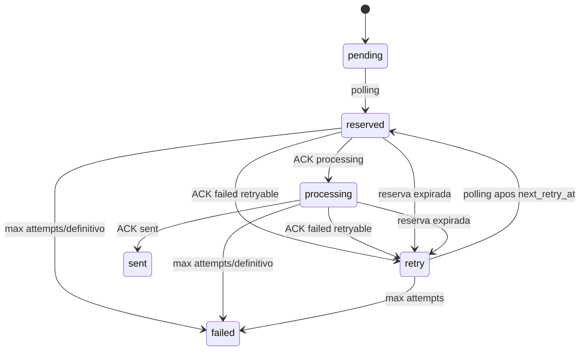

# FasaWait - Documentacao Tecnica Completa

> Fonte oficial de contexto do repositorio. Revisao baseada no codigo local em 19/06/2026, branch `main`, commit de referencia `144bc53`. Este documento descreve o que existe no repositorio; nao confirma, por si so, quais migrations ou variaveis estao aplicadas no ambiente remoto.

## Indice

1. [Resumo Executivo](#1-resumo-executivo)
2. [Arquitetura Geral](#2-arquitetura-geral)
3. [Estrutura do Projeto](#3-estrutura-do-projeto)
4. [Tecnologias Utilizadas](#4-tecnologias-utilizadas)
5. [Fluxo Completo do Sistema](#5-fluxo-completo-do-sistema)
6. [Banco de Dados](#6-banco-de-dados)
7. [Migrations](#7-migrations)
8. [Funcoes SQL e RPCs](#8-funcoes-sql-e-rpcs)
9. [Policies RLS](#9-policies-rls)
10. [Multi-tenancy](#10-multi-tenancy)
11. [Sistema de Filas](#11-sistema-de-filas)
12. [Pagina Publica do Cliente](#12-pagina-publica-do-cliente)
13. [Display Publico](#13-display-publico)
14. [Templates](#14-templates)
15. [Sistema de Notificacoes](#15-sistema-de-notificacoes)
16. [Message Events](#16-message-events)
17. [Desktop Bot Electron](#17-desktop-bot-electron)
18. [QWEP](#18-qwep)
19. [Integracao WhatsApp](#19-integracao-whatsapp)
20. [Seguranca](#20-seguranca)
21. [APIs](#21-apis)
22. [Variaveis de Ambiente](#22-variaveis-de-ambiente)
23. [Configuracoes](#23-configuracoes)
24. [Fluxo Multiempresa](#24-fluxo-multiempresa)
25. [Dependencias Externas](#25-dependencias-externas)
26. [Estrutura de Uploads e Storage](#26-estrutura-de-uploads-e-storage)
27. [Scripts e Utilitarios](#27-scripts-e-utilitarios)
28. [Pontos Fortes](#28-pontos-fortes)
29. [Limitacoes](#29-limitacoes)
30. [Problemas Encontrados](#30-problemas-encontrados)
31. [Debito Tecnico](#31-debito-tecnico)
32. [Melhorias Recomendadas](#32-melhorias-recomendadas)
33. [Prontidao para Producao](#33-prontidao-para-producao)
34. [Roadmap Recomendado](#34-roadmap-recomendado)
35. [Glossario](#35-glossario)

---

## 1. Resumo Executivo

O FasaWait e um SaaS multiempresa de gerenciamento de filas presenciais. O operador cadastra clientes, acompanha a ordem da fila, chama, conclui ou cancela atendimentos. O cliente acompanha seu proprio atendimento por um link individual; uma tela publica por empresa exibe a fila; e notificacoes podem ser registradas de forma simulada ou enviadas por WhatsApp Web por meio do protocolo QWEP.

### Problema resolvido

- Centraliza a fila de cada estabelecimento.
- Substitui controle manual de ordem, senha e chamada.
- Permite acompanhamento remoto por link individual.
- Exibe uma fila publica para TV ou monitor.
- Mantem templates e configuracoes por empresa.
- Desacopla o SaaS da automacao local do WhatsApp.

### Publico-alvo evidenciado pelo produto

Empresas com fila presencial e operadores internos. O codigo nao limita o dominio a restaurantes, clinicas ou varejo; `party_size` e os textos de atendimento indicam uso generico para grupos de clientes.

### Superficies do produto

| Superficie | Finalidade | Local |
|---|---|---|
| SaaS web | Administracao tenant, operacao, dashboard, templates e configuracoes | `src/app`, `src/components`, `src/lib` |
| Plataforma | Gestao global de empresas e usuarios da proprietaria do SaaS | `src/app/(platform)` |
| Pagina individual | Acompanhamento do cliente por token | `/queue/customer/[token]` |
| Display publico | Fila por slug, com modo TV e Realtime Broadcast | `/display/[slug]` |
| FasaWait Bot | Aplicativo Electron Windows que consome QWEP e envia pelo WhatsApp Web | `desktop-bot/` |
| Extensao Chrome | Cliente QWEP alternativo em Manifest V3 | `extension/` |
| Supabase | Auth, PostgreSQL, RLS, RPC, Realtime e Storage | `database/` e clientes em `src/lib/supabase` |

### Estagio e maturidade

O repositorio contem um produto funcional de beta/piloto controlado, nao apenas um prototipo visual. Ha fluxo de autenticacao, multi-tenancy, RLS, operacao Realtime, link individual, estimativa de espera, branding por empresa, QWEP com HMAC, reserva e ACK, Desktop Bot empacotavel e extensao Chrome.

O nivel de maturidade ainda nao e de producao ampla. Nao ha suite automatizada de testes, observabilidade externa, rate limit distribuido, replay protection persistente, transacoes para todos os fluxos compostos nem integracao oficial com WhatsApp. A automacao depende de APIs internas e instaveis do WhatsApp Web.

### Funcionalidades principais implementadas

- Supabase Auth por e-mail e senha.
- Onboarding de empresa e admin inicial.
- Painel global separado para `platform_profiles`.
- Isolamento tenant por `company_id` e RLS.
- CRUD operacional de fila e renumeracao automatica.
- `party_size` entre 1 e 20.
- Link individual com token de 64 caracteres hexadecimais.
- Telefone mascarado na pagina individual.
- Cancelamento publico somente enquanto `waiting`.
- Expiracao configuravel depois de `released`.
- Estimativa de espera por historico recente da mesma empresa.
- Branding da pagina individual por empresa e imagem em Supabase Storage.
- Display por slug com Broadcast publico.
- Templates `queue_created` e `customer_released` por empresa.
- Eventos de notificacao simulados, ignorados ou pendentes para WhatsApp.
- Dispositivos WhatsApp por empresa, token, signing secret e primary sender.
- QWEP v1 com HMAC, timestamp, nonce, reserva, ACK e retry.
- FasaWait Bot com `safeStorage`, tray, auto start, polling e heartbeat.
- Extensao Chrome alternativa com o mesmo contrato QWEP.

---

## 2. Arquitetura Geral

### Visao de alto nivel



### Frontend

- Next.js App Router com React Server Components por padrao.
- Componentes clientes apenas onde ha estado, formularios interativos, Realtime ou browser APIs.
- Tailwind CSS v4 e componentes locais inspirados em Shadcn UI.
- Framer Motion em dashboard, operacao, display e pagina do cliente.
- Lucide React para icones.

As areas internas usam dois layouts protegidos:

- `src/app/(app)/layout.tsx`: chama `requireProfile()` e monta `AppShell`.
- `src/app/(platform)/platform/layout.tsx`: chama `requirePlatformUser()` e monta `PlatformShell`.

### Backend Next.js

O backend esta distribuido em:

- Server Actions em `src/app/actions.ts`.
- Server Actions de plataforma em `src/lib/platform/actions.ts`.
- Server Actions de fila/public branding em `src/lib/queue/customer-queue-actions.ts`.
- Server Actions de dispositivos em `src/lib/whatsapp-devices/actions.ts`.
- Route Handlers em `src/app/api`.
- Helpers server-only para sessao, templates, providers, QWEP e Supabase.

### Supabase

O Supabase cumpre cinco papeis:

1. Auth: identidade em `auth.users`.
2. PostgreSQL: dados do produto.
3. RLS: isolamento tenant e autorizacao de escrita.
4. Realtime: `postgres_changes` autenticado e Broadcast publico.
5. Storage: bucket publico de imagens da pagina do cliente, com escrita tenant protegida.

### Clientes Supabase

| Cliente | Arquivo | Chave | Uso |
|---|---|---|---|
| Server com sessao | `src/lib/supabase/server.ts` | anon/publishable + cookies | Queries tenant, Server Components e Actions sujeitos a RLS |
| Browser | `src/lib/supabase/browser.ts` | anon/publishable | Login, Realtime e RPCs publicas |
| Admin | `src/lib/supabase/admin.ts` | service role/secret | Plataforma, criacao de Auth users, QWEP e operacoes privilegiadas |

O cliente admin nao persiste sessao e nunca e importado por componentes clientes.

### Comunicacao entre modulos



### Proxy e rotas publicas

`src/proxy.ts` atualiza a sessao Supabase e redireciona usuarios sem login para `/login`, exceto prefixos publicos:

- `/api/extension`
- `/login`
- `/auth`
- `/display`
- `/forbidden`
- `/queue/customer`

A publicidade da rota nao significa acesso irrestrito aos dados. Display e pagina individual usam RPCs `security definer`; QWEP usa autenticacao propria.

### Deploy

O repositorio inclui `netlify.toml` com Node 20, `npm run build`, publicacao `.next` e `@netlify/plugin-nextjs`. O codigo tambem e compativel com outro host que suporte Next.js 16 e Route Handlers. Nao ha IaC para criar o projeto Supabase ou configurar DNS.

---

## 3. Estrutura do Projeto

```text
queue-saas/
|- database/                    Migrations SQL e script operacional 999
|- desktop-bot/                 Aplicativo Electron Windows
|  |- assets/                   Icones ICO/PNG
|  |- lib/                      QWEP, storage, fila local e WhatsApp bridge
|  |- renderer/                 HTML, CSS e JavaScript da interface
|  |- main.js                   Processo principal Electron
|  |- preload.js                Ponte IPC restrita
|  `- package.json              Scripts e electron-builder
|- extension/                   Extensao Chrome Manifest V3
|  |- src/background/           Service worker e alarms
|  |- src/lib/                  QWEP, storage, logs, fila e WhatsApp bridge
|  |- src/options/              Configuracao
|  |- src/popup/                Estado e acoes rapidas
|  `- manifest.json
|- public/                      Assets padrao do Next.js
|- src/
|  |- app/                      Rotas, layouts, pages, actions e APIs
|  |- components/               UI por dominio
|  |- lib/                      Regras de negocio e infraestrutura
|  `- proxy.ts                  Protecao e refresh de sessao
|- .env.example                Contrato minimo de ambiente
|- next.config.ts              Limite de Server Actions para upload
|- netlify.toml                Build Netlify
|- package.json                Dependencias e scripts web
`- PROJECT_FULL_DOCUMENTATION.md
```

### Organizacao de `src/app`

| Rota/pasta | Responsabilidade |
|---|---|
| `(app)` | Dashboard, operacao, empresa, usuarios, templates e configuracoes tenant |
| `(platform)` | Dashboard global, empresas clientes e equipe da plataforma |
| `api/queue` | API autenticada de criacao e mudanca de status |
| `api/extension` | API QWEP publica no roteamento, autenticada por dispositivo |
| `auth/redirect` | Decide destino pos-login |
| `display/[slug]` | Display publico por empresa |
| `queue/customer/[token]` | Pagina individual publica |
| `login` | Login e signup |
| `onboarding` | Cria tenant para usuario autenticado sem perfil |

### Organizacao de `src/lib`

| Modulo | Responsabilidade |
|---|---|
| `auth` | Contexto e guards tenant/plataforma |
| `notifications` | Provider configurado, payload e templates |
| `messages` | Provider legado/no-op, aparentemente sem uso atual |
| `platform` | Permissoes e Actions globais |
| `queue` | Criacao, link publico, settings e branding |
| `qwep` | Token, HMAC, criptografia, replay e rate limit |
| `supabase` | Clientes browser/server/admin |
| `types/database.ts` | Tipagem manual do schema e RPCs |
| `validation.ts` | Schemas Zod |
| `phone.ts` | Normalizacao brasileira, formatacao e mascara |
| `public-page-branding.ts` | Defaults e sanitizacao do branding publico |

### Dependencias entre modulos

- Pages internas dependem dos guards em `src/lib/auth`.
- Server Actions tenant usam cliente Supabase com sessao e RLS.
- Acoes de Auth Admin e plataforma usam `createAdminClient()` depois de guard explicito.
- Providers de notificacao consultam `company_settings` e `message_templates`.
- QWEP deriva a empresa exclusivamente do dispositivo encontrado pelo hash do token.
- Desktop Bot e extensao nao acessam Supabase diretamente; chamam `/api/extension/*`.

---

## 4. Tecnologias Utilizadas

### Web

| Tecnologia | Versao declarada | Uso |
|---|---:|---|
| Next.js | 16.2.9 | App Router, RSC, Route Handlers, Server Actions e build |
| React / React DOM | 19.2.4 | Interface |
| TypeScript | 5.x | Tipagem estrita, `noEmit` |
| Tailwind CSS | 4.x | Estilos via PostCSS |
| Framer Motion | 12.40.0 | Animacoes |
| Lucide React | 1.17.0 | Icones |
| Zod | 4.4.3 | Validacao de entrada |
| Supabase JS | 2.108.1 | DB, Auth, RPC, Realtime e Storage |
| Supabase SSR | 0.12.0 | Cookies e sessao server/browser |
| Radix Slot / CVA / clsx / tailwind-merge | versoes do `package.json` | Composicao de componentes |

### Banco e infraestrutura

- PostgreSQL gerenciado pelo Supabase.
- `pgcrypto` para UUIDs, bytes aleatorios e digest SQL.
- Supabase Auth.
- Supabase Realtime: Postgres Changes e Broadcast.
- Supabase Storage.
- Netlify plugin para Next.js como configuracao de deploy presente.

### Desktop e extensao

| Tecnologia | Uso |
|---|---|
| Electron 42.4.0 | FasaWait Bot |
| electron-builder 26.15.3 | Instalador NSIS x64 |
| Node.js APIs | Crypto, filesystem, path e timers |
| Chrome Manifest V3 | Extensao alternativa |
| Web Crypto API | HMAC/SHA-256 na extensao |
| `chrome.storage.local` | Configuracao e estado da extensao |
| `chrome.alarms` | Polling e heartbeat da extensao |

### Qualidade e build

- ESLint 9 + `eslint-config-next`.
- `next build` executa compilacao e verificacao TypeScript.
- Desktop Bot usa `node --check` nos arquivos JavaScript como lint sintatico.
- Nao ha Jest, Vitest, Playwright, Cypress nem testes unitarios/integracao versionados.

---

## 5. Fluxo Completo do Sistema

### 1. Cadastro e login

`src/components/auth/login-form.tsx` usa `signUp` ou `signInWithPassword`. Depois do login, `/auth/redirect` chama `getPostLoginRedirectPath()`:

1. `platform_profiles` ativo -> `/platform/dashboard`.
2. `profiles` ativo -> `/dashboard`.
3. Nenhum perfil -> `/onboarding`.

Se o projeto Supabase exigir confirmacao de e-mail, o signup pode nao criar sessao imediata; essa configuracao externa nao e comprovavel pelo repositorio.

### 2. Criacao da empresa

Ha dois caminhos:

- Self-service: `createCompanyOnboardingAction()` cria `companies` e o `profiles` admin para o usuario logado.
- Plataforma: `createClientCompanyAction()` cria empresa, usuario no Auth e perfil admin inicial.

Ambos usam service role no servidor. O trigger `companies_ensure_settings` cria `company_settings` automaticamente. As operacoes compostas nao estao encapsuladas em uma unica transacao; falhas intermediarias podem deixar registros orfaos.

### 3. Configuracao inicial

Nova empresa recebe por default:

- expiracao do link: 5 minutos;
- canal: `simulated`;
- estimativa habilitada: 15 minutos, amostra 10, margem 25%;
- branding azul/verde, sem imagem.

Templates nao sao criados no banco; o provider usa defaults em codigo. Dispositivo WhatsApp tambem nao e criado automaticamente.

### 4. Criacao do cliente na fila

O operador envia nome, telefone e `party_size`. `queueEntrySchema` normaliza o telefone para DDI 55 e valida DDD brasileiro. A insercao inclui `company_id` e `created_by` da sessao.

O trigger `set_queue_entry_defaults`:

- gera `ticket_code` no formato `QYYYYMMDD-XXXXXX`;
- aplica `status = waiting`;
- usa advisory lock por empresa;
- calcula `max(position) + 1` dentro da empresa;
- remove posicao de status nao `waiting`.

O default de `public_customer_token` gera 64 caracteres hexadecimais.

### 5. Geracao do link publico

`buildCustomerQueueLink()` combina `NEXT_PUBLIC_APP_URL` com `/queue/customer/{token}`. O link nao e armazenado; somente o token fica no banco.

### 6. Template e payload

O provider busca o template ativo por `company_id` e tipo. Se nao existir, usa `DEFAULT_MESSAGE_TEMPLATE_CONTENT`. A mensagem final e renderizada antes da insercao em `message_events` e armazenada em `payload.message`.

### 7. Criacao do `message_event`

Conforme `company_settings.notification_channel`:

- `none`: evento `skipped`, provider `none`;
- `simulated`: evento `simulated`, provider `none`;
- `whatsapp_extension`: evento `pending`, provider `whatsapp_extension`;
- `evolution_api` ou `sms`: atualmente caem no provider no-op e ficam `simulated`.

### 8. Polling QWEP

O Bot ou a extensao envia `GET /api/extension/messages/pending`. O backend:

1. valida Bearer token;
2. valida HMAC, timestamp, nonce e hash do corpo;
3. exige dispositivo primary sender;
4. deriva `company_id` do token;
5. libera reservas expiradas da empresa;
6. seleciona apenas eventos `whatsapp_extension` da mesma empresa;
7. cria `reservation_id` e token de reserva;
8. incrementa `attempt_count` e expira a reserva em 120 segundos.

### 9. ACK de processamento

Antes de enviar, o cliente envia `status = processing` com:

- ID da mensagem na URL;
- `reservation_id`;
- `reservation_token` puro retornado uma unica vez.

O backend confere empresa, dispositivo, reserva e hash do token.

### 10. Envio pelo WhatsApp

O Desktop Bot abre uma janela Electron persistente do WhatsApp Web; a extensao usa uma aba existente. Ambos procuram modulos internos do WhatsApp Web para localizar/criar o chat e enviar texto sem navegar para `wa.me`.

### 11. ACK final

- `sent`: grava `sent_at`, provider response e log `message_sent_ack`.
- `failed` retryable: muda para `retry`, limpa reserva e agenda 60 ou 300 segundos.
- `failed` definitivo ou max attempts: muda para `failed` e grava `failed_at`.

### 12. Chamada/liberacao

A acao principal aceita somente entrada `waiting`, muda para `released`, grava operador/data e envia exclusivamente o evento/template `customer_released`.

### 13. Conclusao

O operador muda `waiting` ou `released` para `completed` e grava `completed_at`. A pagina individual deixa de exibir detalhes.

### 14. Cancelamento

- Interno: operador pode cancelar `waiting` ou `released`.
- Publico: RPC aceita somente `waiting`, grava `cancelled_by_customer = true`.

### 15. Expiracao

Para `released`, a RPC calcula `released_at + released_link_expiration_minutes`. Depois desse instante, nome, telefone, ticket, posicao, grupo, entrada, horario de liberacao e imagem de fundo deixam de ser retornados.

---

## 6. Banco de Dados

O schema de aplicacao possui nove tabelas publicas. `auth.users`, `storage.buckets` e `storage.objects` pertencem aos schemas gerenciados pelo Supabase.

### 6.1 `companies`

**Finalidade:** tenant e cadastro empresarial.

| Coluna | Tipo/regra | Uso |
|---|---|---|
| `id` | UUID PK, `gen_random_uuid()` | Identificador do tenant |
| `cnpj` | text, not null, unique, 14 digitos | Identificacao fiscal |
| `corporate_name` | text, not null | Razao social |
| `trade_name` | text, not null | Nome exibido |
| `email` | text, not null | Contato |
| `phone` | text nullable | Telefone empresarial |
| `status` | enum `active/inactive` | Bloqueio operacional |
| `public_queue_slug` | text, unique, regex | URL do display |
| `created_at`, `updated_at` | timestamptz | Auditoria basica |

Relacionamentos: tabela pai de perfis, fila, templates, eventos, settings e dispositivos. Exclusao da empresa propaga para a maioria desses dados.

### 6.2 `profiles`

**Finalidade:** vincular usuario Auth a exatamente uma empresa.

| Coluna | Regra |
|---|---|
| `id` | UUID PK |
| `user_id` | FK `auth.users`, unique, cascade delete |
| `company_id` | FK `companies`, not null, cascade delete |
| `name`, `email` | text not null |
| `role` | enum `admin/employee`, default `employee` |
| `status` | enum `active/inactive` |
| `created_at`, `updated_at` | timestamps |

Constraint adicional: e-mail unico dentro da empresa. Como `user_id` e globalmente unico, um usuario Auth nao pode pertencer a dois tenants via `profiles`.

### 6.3 `platform_profiles`

**Finalidade:** equipe da proprietaria do SaaS, fora do modelo tenant.

| Coluna | Regra |
|---|---|
| `id` | UUID PK |
| `user_id` | FK Auth, unique |
| `name`, `email` | not null; email unique |
| `role` | `owner`, `admin` ou `support` |
| `status` | `active` ou `inactive` |
| `created_at`, `updated_at` | timestamps |

Nao possui `company_id` intencionalmente. Acesso global ocorre em codigo server-side com service role, depois de validar esse perfil.

### 6.4 `company_settings`

**Finalidade:** configuracoes 1:1 por empresa.

| Coluna | Default / constraint |
|---|---|
| `company_id` | PK e FK `companies` |
| `released_link_expiration_minutes` | 5; entre 1 e 60 |
| `notification_channel` | `simulated`; `none`, `simulated`, `whatsapp_extension`, `evolution_api`, `sms` |
| `estimated_wait_enabled` | true |
| `estimated_wait_default_minutes` | 15; entre 1 e 120 |
| `estimated_wait_sample_size` | 10; entre 3 e 50 |
| `estimated_wait_margin_percent` | 25; entre 0 e 100 |
| `public_page_primary_color` | `#4169E1`, HEX |
| `public_page_secondary_color` | `#1BAF9C`, HEX |
| `public_page_position_card_background_url` | nullable; URL HTTPS do bucket esperado |
| `public_page_position_card_overlay_color` | `#0F172A`, HEX |
| `public_page_position_card_text_color` | `#FFFFFF`, HEX |
| `created_at`, `updated_at` | timestamps |

### 6.5 `queue_entries`

**Finalidade:** entradas e historico da fila.

| Coluna | Regra / uso |
|---|---|
| `id` | UUID PK |
| `company_id` | FK tenant, not null |
| `customer_name` | Nome completo usado internamente e no display |
| `customer_phone` | Telefone normalizado; sensivel |
| `ticket_code` | Gerado por trigger; unico por empresa |
| `status` | `waiting`, `released`, `completed`, `cancelled` |
| `position` | positivo ou null |
| `party_size` | 1..20, default 1 |
| `public_customer_token` | 64 hex, unique, default aleatorio |
| `cancelled_by_customer` | default false |
| `created_by`, `released_by` | FK `profiles`, `set null` |
| `created_at` | entrada na fila |
| `released_at`, `completed_at`, `cancelled_at` | transicoes |

`replica identity full` esta habilitado para Realtime. Nao existe coluna `updated_at`.

### 6.6 `message_templates`

**Finalidade:** conteudo de notificacao por empresa.

| Coluna | Regra |
|---|---|
| `id` | UUID PK |
| `company_id` | FK tenant |
| `type` | `queue_created` ou `customer_released` |
| `title`, `content` | texto |
| `active` | boolean |
| `created_at`, `updated_at` | timestamps |

Indice parcial garante no maximo um template ativo por `(company_id, type)`.

### 6.7 `message_events`

**Finalidade:** outbox, auditoria e lifecycle de mensageria.

| Grupo | Colunas |
|---|---|
| Identidade | `id`, `company_id`, `queue_entry_id` |
| Mensagem | `provider`, `channel`, `type`, `payload` |
| Estado | `status`, `error_message`, `created_at` |
| Reserva | `device_id`, `reservation_id`, `reservation_token_hash`, `reserved_at`, `reservation_expires_at` |
| Processamento | `processing_started_at`, `sent_at`, `failed_at` |
| Retry | `attempt_count` >= 0, `max_attempts` 1..10, `next_retry_at` |
| Idempotencia | `idempotency_key` unique quando nao null |
| Resposta | `provider_response` JSONB |

Providers do enum: `none`, `evolution_api`, `whatsapp_extension`, `sms`. Status: `recorded`, `pending`, `reserved`, `processing`, `retry`, `cancelled`, `expired`, `simulated`, `skipped`, `sent`, `failed`.

### 6.8 `whatsapp_devices`

**Finalidade:** credenciais e estado de clientes QWEP por empresa.

| Coluna | Uso |
|---|---|
| `id`, `company_id`, `name` | Identidade tenant |
| `token_hash` | SHA-256 prefixado; unique; token puro nao salvo |
| `signing_secret_hash` | Valida bootstrap `/auth/validate` |
| `signing_secret_encrypted` | Segredo AES-256-GCM para validar HMAC |
| `status` | created, pending_activation, active, disconnected, error, revoked, expired |
| `is_primary_sender` | Elegibilidade para polling |
| `connected_phone` | Telefone reportado pelo cliente |
| `browser_name`, `user_agent`, `extension_version` | Diagnostico |
| `last_seen_at`, `last_connected_at`, `last_disconnected_at` | Saude |
| `created_by` | FK Auth |
| `created_at`, `updated_at`, `revoked_at` | Auditoria |

Indice parcial garante um primary nao revogado por empresa.

### 6.9 `whatsapp_device_logs`

**Finalidade:** auditoria sanitizada de dispositivos.

| Coluna | Uso |
|---|---|
| `id` | UUID PK |
| `company_id` | Tenant obrigatorio |
| `device_id` | FK, `set null` |
| `event_type` | Enum logico via CHECK |
| `message` | Descricao curta |
| `metadata` | JSONB sanitizado por convencao de codigo |
| `created_at` | Ordenacao |

Eventos permitidos incluem criacao, ativacao, revogacao, heartbeat, reserva, ACK, falha de auth, erro, troca de primary e rate limit.

### 6.10 Indices relevantes

- Slug, `profiles.company_id`, `profiles.user_id`.
- Fila por empresa/status/posicao e por datas.
- Templates por empresa/tipo e unicidade parcial do ativo.
- Eventos por empresa/data, queue entry, pendencia QWEP, reserva e idempotencia.
- Dispositivos por empresa/status, token hash e primary parcial.
- Logs por empresa/data e dispositivo/data.
- `company_settings.notification_channel`.

---

## 7. Migrations

As migrations sao arquivos SQL manuais; nao ha CLI de migrations configurada. Devem ser executadas em ordem. A existencia local nao prova aplicacao no Supabase remoto.

| Migration | Objetivo e impacto |
|---|---|
| `001_create_companies.sql` | Enum de status e tabela `companies`; CNPJ/slug unicos |
| `002_create_profiles.sql` | Roles/status tenant e tabela `profiles` ligada ao Auth |
| `003_create_queue_entries.sql` | Enum/status e tabela base da fila |
| `004_create_message_templates.sql` | Tipos e templates por empresa |
| `005_create_message_events.sql` | Providers/status iniciais e eventos |
| `006_create_functions_triggers.sql` | Helpers tenant, defaults, renumeracao, RPCs publicas, triggers e Broadcast |
| `007_create_rls_policies.sql` | RLS e grants das tabelas tenant iniciais |
| `008_create_indexes_realtime.sql` | Indices, replica identity e publicacao Realtime |
| `009_fix_queue_ticket_generation.sql` | Troca `gen_random_bytes` por UUID no ticket |
| `010_create_platform_profiles.sql` | Tabela de equipe da plataforma |
| `011_create_platform_functions.sql` | Helpers owner/admin/support |
| `012_create_platform_rls_policies.sql` | RLS de `platform_profiles` |
| `013_add_party_size_to_queue_entries.sql` | `party_size` 1..20 |
| `014_add_public_customer_token_to_queue_entries.sql` | Token publico, indice unique e flag de cancelamento |
| `015_add_queue_link_expiration_settings.sql` | `company_settings`, defaults e trigger de criacao |
| `016_update_message_events_for_customer_links.sql` | Status `simulated` e `skipped` |
| `017_update_public_customer_queue_link_rls.sql` | RPC individual, mascara, cancelamento, Broadcast individual e RLS de settings |
| `018_create_whatsapp_devices.sql` | Dispositivos QWEP e credenciais protegidas |
| `019_create_whatsapp_device_logs.sql` | Logs por dispositivo/empresa |
| `020_update_message_events_for_qwep.sql` | Estados QWEP, reserva/retry/idempotencia e canal por empresa |
| `021_create_whatsapp_device_functions.sql` | Primary, revogacao, liberacao de reserva e reserva atomica SQL |
| `022_create_whatsapp_device_rls_policies.sql` | RLS/grants de dispositivos e logs |
| `023_create_whatsapp_indexes.sql` | Indices QWEP e primary unico |
| `024_update_public_customer_link_expiration.sql` | Oculta detalhes apos expiracao/conclusao/cancelamento |
| `025_harden_whatsapp_device_rpc.sql` | Restringe `get_primary_whatsapp_device` a service role |
| `026_add_estimated_wait_time.sql` | Settings e calculo tenant da estimativa publica |
| `027_add_public_page_branding.sql` | Cores, bucket, policies Storage e branding na RPC |
| `999_cleanup_operational_test_data.sql` | Script destrutivo opcional: apaga fila, eventos e logs, preservando tenants/configuracoes |

### Observacoes cumulativas

- A definicao efetiva de `get_public_customer_queue_entry` e a da migration 027.
- A definicao efetiva de `get_primary_whatsapp_device` e a da 025.
- A definicao efetiva de `set_queue_entry_defaults` e a da 009.
- A definicao efetiva de `emit_public_queue_broadcast` e `get_public_queue_entries` e a da 017.
- A migration 027 depende das anteriores, especialmente 006, 015, 017 e 026.
- Constraints adicionadas em 020 usam `NOT VALID`; novas linhas sao verificadas, mas dados antigos so ficam totalmente certificados depois de `VALIDATE CONSTRAINT`.

---

## 8. Funcoes SQL e RPCs

### Helpers internos e triggers

| Funcao | Parametros / retorno | Seguranca e uso |
|---|---|---|
| `set_updated_at()` | trigger | Atualiza `updated_at` |
| `current_profile_id()` | UUID | `security definer`; perfil ativo de `auth.uid()` |
| `current_company_id()` | UUID | `security definer`; tenant do perfil ativo |
| `is_company_member(uuid)` | boolean | Base das policies tenant |
| `is_company_admin(uuid)` | boolean | Base das escritas administrativas |
| `set_queue_entry_defaults()` | trigger | Advisory lock, ticket e posicao por empresa |
| `renumber_waiting_queue(uuid)` | void | Reordena `waiting` por `created_at,id` |
| `after_queue_entry_change()` | trigger | Chama renumeracao apos insert/update/delete |
| `ensure_company_settings()` | trigger | Cria defaults 1:1 apos insert em empresa |
| `generate_public_customer_token()` | text | Dois UUIDs sem hifens, 64 hex |
| `emit_public_queue_broadcast()` | trigger | Envia payload limitado para canais publicos |

### Helpers da plataforma

| Funcao | Retorno | Regra |
|---|---|---|
| `is_platform_owner()` | boolean | Perfil ativo com role owner |
| `is_platform_admin()` | boolean | owner ou admin |
| `is_platform_support()` | boolean | owner, admin ou support |
| `is_platform_user()` | boolean | Alias de support |

### RPCs publicas

#### `get_public_company(queue_slug text)`

Retorna somente `id`, `trade_name` e slug de empresa ativa. Usada pelo display. Executavel por `anon` e `authenticated`.

#### `get_public_queue_entries(queue_slug text)`

Retorna entradas `waiting` e `released` da empresa encontrada pelo slug, incluindo ID, `company_id`, nome, ticket, status, posicao, grupo e datas. Nao retorna telefone ou token. E `security definer` e publica.

#### `mask_customer_phone(raw_phone text)`

Remove caracteres, trata DDI 55 e devolve DDD + ultimos quatro digitos, ou mascara generica.

#### `get_public_customer_queue_entry(customer_token text)`

RPC efetiva da migration 027. Usa token globalmente unico, exige empresa ativa e junta settings por `q.company_id`. Retorna:

- dados mascarados/minimos do cliente;
- status e expiracao;
- estimativa calculada apenas com historico do mesmo `company_id`;
- cinco campos de branding.

Dados de atendimento sao visiveis somente em `waiting` ou `released` ainda valido. A imagem e ocultada quando os detalhes deixam de ser visiveis. A funcao revoga `PUBLIC` e concede execucao a `anon`, `authenticated` e `service_role`.

#### `cancel_public_customer_queue_entry(customer_token text)`

Atualiza uma unica entrada identificada pelo token somente se `status = waiting`; grava cancelamento e flag de origem. Nao exige sessao por design.

### RPCs de dispositivos

#### `get_primary_whatsapp_device(target_company_id uuid)`

Retorna a linha completa do primary nao revogado. A migration 025 revoga anon/authenticated e concede apenas a `service_role`; a propria funcao tambem verifica role. Como a linha contem hashes e segredo criptografado, nao deve ser exposta ao cliente.

#### `set_primary_whatsapp_device(target_device_id uuid)`

Valida admin tenant ou admin da plataforma, desmarca os demais dispositivos da empresa, marca o alvo e grava log. O indice parcial reforca unicidade.

#### `revoke_whatsapp_device(target_device_id uuid)`

Valida autorizacao, revoga o dispositivo, remove primary e devolve eventos reservados/processando daquela empresa/dispositivo para `retry`.

#### `release_expired_message_reservations()`

Service role. Libera todas as reservas expiradas: `failed` quando atingiu `max_attempts`, senao `retry`.

#### `reserve_pending_message_events(target_device_id, batch_limit)`

Service role. Funcao SQL atomica com `FOR UPDATE SKIP LOCKED`, filtro por empresa do dispositivo, primary ativo, provider, status e attempts. Embora exista e esteja tipada, a rota atual de pending implementa reserva propria em TypeScript em vez de chamar essa RPC.

---

## 9. Policies RLS

### Matriz atual

| Tabela | SELECT | INSERT | UPDATE | DELETE |
|---|---|---|---|---|
| `companies` | membro da empresa | nao concedido | admin da empresa | nao concedido |
| `profiles` | mesma empresa ou proprio user | admin da empresa | admin da empresa | nao concedido |
| `queue_entries` | membro | membro | membro | nao concedido |
| `message_templates` | membro | admin | admin | nao concedido |
| `message_events` | membro | membro | sem grant/policy tenant | nao concedido |
| `company_settings` | membro | admin | admin | nao concedido |
| `platform_profiles` | usuario da plataforma | owner/admin conforme role | owner/admin conforme role | nao concedido |
| `whatsapp_devices` | membro ou usuario plataforma | admin tenant/plataforma | admin tenant/plataforma | nao concedido |
| `whatsapp_device_logs` | admin tenant ou usuario plataforma | admin tenant/plataforma | nao concedido | nao concedido |

### Storage

Para `storage.objects` no bucket `company-public-assets`, SELECT/INSERT/UPDATE/DELETE autenticados exigem:

- primeiro segmento da pasta igual a `current_company_id()`;
- usuario admin daquela empresa;
- bucket correto.

O bucket e publico, portanto leitura por URL publica nao depende de policy de SELECT. Isso e intencional para a pagina anonima.

### Isolamento

As policies tenant usam `company_id` da linha e funcoes baseadas em `auth.uid()`. O frontend adiciona `.eq("company_id", ...)` em consultas importantes, mas o limite de seguranca principal continua no PostgreSQL.

### Pontos de atencao

- Service role ignora RLS; toda chamada admin precisa de guard e filtro explicito.
- Funcionarios podem atualizar qualquer campo de `queue_entries` da propria empresa via API Supabase se construirem uma requisicao valida com a propria sessao, pois a policy de update nao restringe colunas nem transicoes. A UI limita o fluxo, mas o banco nao implementa uma maquina de estados.
- RPCs `security definer` devem manter `search_path` fixo e retorno minimo. As principais funcoes fazem isso.
- Nao ha policies de delete para tabelas do produto; exclusoes operacionais sao representadas por status.

---

## 10. Multi-tenancy

### Chave de isolamento

`company_id` aparece em todas as entidades tenant sensiveis:

- `profiles`
- `company_settings`
- `queue_entries`
- `message_templates`
- `message_events`
- `whatsapp_devices`
- `whatsapp_device_logs`

`companies.id` e a raiz do tenant. `platform_profiles` e a excecao intencional.

### Resolucao do tenant

- Usuario web: `profiles.user_id = auth.uid()`.
- Server Actions tenant: `requireProfile()` ou `requireAdmin()` devolve company da sessao.
- QWEP: `token_hash` identifica dispositivo; `device.company_id` identifica tenant.
- Link individual: token identifica `queue_entries`; a empresa vem da propria linha.
- Display: slug unico identifica `companies`; entries sao unidas por `q.company_id`.
- Storage: primeira pasta e UUID da empresa da sessao.

### Criacao do tenant



### Empresa criada pela plataforma

Owner/admin da plataforma cria empresa, usuario Auth confirmado e perfil admin. O suporte pode visualizar empresas, mas nao criar/editar nem resetar senha conforme `permissions.ts`.

### O que nasce pronto

- Fila web: sim.
- Settings: sim, pelo trigger.
- Display: sim, pelo slug.
- Link individual: sim, pelo default do token.
- Templates: fallback em codigo, sem linhas iniciais.
- WhatsApp real: nao; requer dispositivo, credenciais, primary sender e canal.

### Risco de consistencia

Criacao de empresa, usuario Auth e perfil ocorre em chamadas separadas. Nao ha rollback compensatorio completo. Esse ponto e tratado nas secoes de problemas e roadmap.

---

## 11. Sistema de Filas

### Criacao

Disponivel pela UI operacional, Server Action e `POST /api/queue`. Nome, telefone e grupo sao validados. O telefone e salvo como `55DDDNUMERO`.

### Ordenacao e posicao

- Cada empresa possui uma fila logica unica.
- Nao ha mesas, categorias ou prioridades.
- Novos `waiting` entram em `max(position) + 1` sob advisory lock por empresa.
- Depois de insert/update/delete, todos os `waiting` sao renumerados por `created_at,id`.
- Entradas fora de `waiting` ficam sem posicao.

### Estados

```text
waiting -> released -> completed
waiting -> completed
waiting -> cancelled
released -> cancelled
```

Esse e o fluxo pretendido pelas Server Actions. A API generica de status nao aplica todas essas pre-condicoes e atualmente permite transicoes indevidas.

### Chamada

`releaseQueueEntryAction` atualiza apenas `waiting`, grava `released_by`, `released_at` e gera notificacao `customer_released` se a linha foi efetivamente alterada.

### Conclusao e cancelamento

- Conclusao interna aceita `waiting` e `released`.
- Cancelamento interno aceita `waiting` e `released`.
- Cancelamento publico aceita apenas `waiting`.

### Realtime

Dashboard e operacao assinam `postgres_changes` com filtro `company_id`. Ao receber evento, refazem consultas filtradas; nao confiam no payload para montar toda a visao.

### Historico

`queue_entries` preserva concluidos/cancelados. Nao ha pagina dedicada de historico, exportacao, arquivamento ou retencao.

---

## 12. Pagina Publica do Cliente

### Rota e token

`/queue/customer/[token]` aceita somente regex `^[a-f0-9]{64}$`. O token possui indice unique global. Token invalido, inexistente ou empresa inativa produz 404.

### Dados exibidos

Enquanto visivel:

- nome da empresa;
- nome do cliente;
- telefone mascarado;
- ticket;
- posicao;
- quantidade de pessoas;
- horario de entrada;
- status;
- estimativa de espera;
- branding.

Telefone completo, IDs internos, historico e configuracoes administrativas nao sao retornados pela RPC atual.

### Atualizacao

- Botao de refresh chama novamente a RPC.
- Canal Broadcast publico `public-customer-queue:{token}` dispara refresh.
- Um timer local de 1 segundo atualiza a contagem de expiracao.

### Saida da fila

O dialogo chama Server Action, valida o token e executa `cancel_public_customer_queue_entry`. A RPC so altera `waiting`.

### Expiracao e estados finais

- `waiting`: detalhes e opcao de sair.
- `released`: mostra chamada e contagem regressiva.
- `released` expirado: detalhes ocultos.
- `completed`: tela final sem detalhes.
- `cancelled`: tela final sem detalhes.

### Estimativa de espera

Para os ultimos N atendimentos da mesma empresa com `released_at > created_at`:

1. calcula minutos de espera;
2. tira media;
3. usa default da empresa se nao houver historico;
4. multiplica pela posicao atual;
5. aplica margem percentual;
6. arredonda com minimo 1 minuto.

So aparece em `waiting`, com configuracao habilitada e posicao positiva.

### Branding

- Cores sao validadas como HEX.
- Sem imagem: gradiente primary/secondary.
- Com imagem: `cover`, centralizada e overlay de 35%.
- A configuracao afeta somente a pagina individual; o display nao foi personalizado.
- URL e novamente sanitizada no frontend antes de compor CSS.

### Seguranca residual do token

O token e uma credencial por posse. Nao existe senha adicional, rate limit na RPC publica ou revogacao isolada de token. O risco e mitigado pela alta entropia, mas links compartilhados continuam acessiveis ate o status/expiracao ocultar detalhes.

---

## 13. Display Publico

### Funcionamento

`/display/[slug]` chama:

1. `get_public_company(slug)`;
2. `get_public_queue_entries(slug)`.

O componente separa `waiting` e `released`, oferece tema claro/escuro, modo TV e fullscreen. Quando recebe Broadcast de uma liberacao, mostra uma sobreposicao temporaria de chamada.

### Realtime

O trigger envia Broadcast publico em `public-display:{slug}`. O browser nao assina diretamente `queue_entries` como anon; ao receber o evento, refaz a RPC publica.

### Dados publicos

O display mostra nome completo, ticket, posicao e tamanho do grupo. O RPC tambem retorna IDs, `company_id` e timestamps. Telefone e token individual nao sao retornados.

### Isolamento

O slug e unique e a RPC faz join entre empresa encontrada e `queue_entries.company_id`. Nao ha consulta global sem o slug.

### Limitacoes

- Entradas `released` nao possuem janela de retencao no RPC do display; permanecem visiveis ate mudarem de status.
- Nome completo no display publico pode ser inadequado sob requisitos de privacidade mais estritos.
- O branding da pagina individual nao e aplicado ao display.

---

## 14. Templates

### Tipos

- `queue_created`: ao cadastrar cliente.
- `customer_released`: ao chamar cliente.

### Variaveis

| Placeholder | Origem |
|---|---|
| `{{nome_cliente}}` | `queue_entries.customer_name` |
| `{{telefone_cliente}}` | telefone normalizado |
| `{{nome_empresa}}` | `companies.trade_name` |
| `{{codigo_senha}}` | `ticket_code` |
| `{{link_fila}}` | link individual |
| `{{quantidade_pessoas}}` | `party_size` |
| `{{posicao_fila}}` | posicao ou `atendimento` |

### Busca e isolamento

`getCompanyMessageTemplate(companyId, type)` usa service role, mas filtra explicitamente `company_id`, `type` e `active`, ordenando pela atualizacao mais recente. Nao ha fallback para template de outra empresa.

### Renderizacao

Regex substitui placeholders conhecidos e preserva placeholders desconhecidos. A mensagem final e gravada em `payload.message` no momento de criacao do evento; mudancas posteriores no template nao alteram eventos existentes.

### Fallbacks

Os defaults ficam em `src/lib/message-template-defaults.ts`. Uma empresa nova funciona sem registros em `message_templates`.

### Administracao

Somente admins tenant editam templates. O indice parcial e a Action de upsert tentam garantir um ativo por tipo. O template de liberacao e sempre buscado com tipo `customer_released`.

---

## 15. Sistema de Notificacoes

### Selecao do provider

`ConfiguredNotificationProvider` consulta `company_settings.notification_channel` pelo `company_id` do contexto.

| Canal | Implementacao atual | Resultado |
|---|---|---|
| `none` | `DisabledNotificationProvider` | evento `skipped` |
| `simulated` | `NoopNotificationProvider` | evento `simulated` |
| `whatsapp_extension` | `ExtensionWhatsAppProvider` | evento `pending` |
| `evolution_api` | sem provider real | cai em `simulated` |
| `sms` | sem provider real | cai em `simulated` |

A UI atual oferece apenas Nenhum, Simulado e Extensao WhatsApp.

### Eventos gerados

- Entrada na fila -> `queue_created`.
- Chamada -> `customer_released`.
- Conclusao/cancelamento nao geram notificacao.

### Idempotencia

Para WhatsApp, a chave combina empresa, queue entry, tipo, status e `released_at` quando aplicavel. O indice unique impede duas insercoes com a mesma chave exata.

### Tratamento de falha

Os metodos retornam status/erro, mas os chamadores principais nao interrompem a operacao da fila se a insercao do evento falhar. A fila continua consistente, porem a notificacao pode ser perdida sem alerta visivel ao operador.

### Providers legados

`src/lib/messages/provider.ts` e `noop-provider.ts` representam arquitetura anterior e aparentemente nao sao importados pelo fluxo atual, que usa `src/lib/notifications`.

---

## 16. Message Events

### Lifecycle QWEP



Estados `recorded`, `simulated`, `skipped`, `cancelled` e `expired` existem no enum, mas nao fazem parte do envio ativo QWEP principal.

### Reserva

- Duracao: 120 segundos.
- Token de reserva: 32 bytes em hex, retornado puro uma vez.
- Banco armazena apenas hash prefixado.
- `attempt_count` incrementa ao reservar.
- `max_attempts` default/uso atual: 3.

### Implementacao usada pela rota

`messages/pending/route.ts` implementa selecao e updates em TypeScript com service role e filtros de empresa. Cada update exige ID, `company_id`, `device_id IS NULL` e status elegivel. Isso evita que duas atualizacoes reservem a mesma linha, mas e menos eficiente e menos claramente atomico que a RPC SQL com `SKIP LOCKED` ja existente.

### ACK idempotente

Se o evento ja estiver `sent` ou `failed`, a rota devolve status com `idempotent: true`. Para outros estados, exige correspondencia integral da reserva.

### Retry

- Primeira falha: 60 segundos.
- Falhas posteriores: 300 segundos.
- Falha `retryable = false` encerra imediatamente.
- Reserva expirada respeita `attempt_count >= max_attempts`.

### Dados sensiveis

`payload` contem telefone normalizado, nome, link individual e mensagem final. Portanto `message_events` e tabela sensivel, protegida por RLS e nunca retornada pela API publica.

---

## 17. Desktop Bot Electron

### Arquitetura

| Arquivo | Responsabilidade |
|---|---|
| `main.js` | Ciclo Electron, janelas, tray, timers, IPC e auto start |
| `preload.js` | API `window.queueBot` via `contextBridge` |
| `renderer/index.html` | Estrutura da interface |
| `renderer/app.js` | Formularios, status amigaveis, logs e acoes |
| `renderer/styles.css` | Layout compacto e responsivo |
| `lib/storage.js` | Credenciais, estado e logs locais |
| `lib/qwep-client.js` | HTTP QWEP e assinatura |
| `lib/message-queue.js` | Locks, polling, envio e ACK |
| `lib/whatsapp-bridge.js` | Janela e APIs internas do WhatsApp Web |
| `lib/logger.js` | Logs sanitizados |
| `lib/crypto.js` | SHA-256, HMAC e nonce |

### Processo principal

- Single instance lock.
- Remove menu nativo com `Menu.setApplicationMenu(null)`.
- Janela principal 980x720, minimo 820x600.
- Fechar esconde na bandeja; `Sair` encerra.
- Janela separada do WhatsApp usa particao persistente `persist:queue-saas-whatsapp` para compatibilidade com sessoes antigas.
- Reabre automaticamente o bot se `botRunning` estava persistido.

### Renderer e IPC

O renderer nao possui Node integration. O preload expoe somente:

- get/save/clear config;
- testar conexao;
- iniciar/parar/resetar;
- abrir/atualizar WhatsApp;
- auto start;
- assinatura de atualizacoes de estado.

### Armazenamento

Arquivo: `fasawait-bot-state.json` no `app.getPath("userData")`. Ha migracao de `queue-saas-bot-state.json` e diretorios legados.

- Token e signing secret usam Electron `safeStorage` quando disponivel.
- Se indisponivel, o codigo usa `plain_fallback` e salva texto puro.
- Configuracao publica enviada ao renderer contem apenas flags de existencia dos segredos.
- Logs e estado ficam no mesmo JSON.
- Maximo de 120 logs locais.

### Timers e operacao

- Heartbeat minimo: 30 s.
- Polling: clamp entre 20 e 30 s.
- Uma mensagem por ciclo.
- Delay real de envio aleatorio: 5 a 10 s.
- Backoff de 60 s em falha e 30 s para skips inesperados.
- Lock local persistente com timeout de 60 s.

### Tray e auto start

Tray: abrir painel, abrir WhatsApp Web, iniciar/pausar, sair. Auto start usa `app.setLoginItemSettings` e e persistido na configuracao.

### WhatsApp

A janela WhatsApp tem `contextIsolation`, `nodeIntegration: false` e `sandbox: true`. O script executado recebe somente telefone, mensagem e timeout; credenciais QWEP nao sao injetadas.

### Build

`npm run dist` executa `electron-builder --win nsis`:

- appId tecnico legado: `com.queuesaas.whatsappbot`;
- productName: FasaWait Bot;
- instalador x64 NSIS;
- instalacao por usuario, diretorio selecionavel;
- atalhos Desktop e Menu Iniciar;
- artefato `FasaWait Bot Setup.exe`.

### Limitacoes especificas

- O renderer principal usa `sandbox: false`; a superficie e limitada por `nodeIntegration: false` e CSP local, mas sandbox seria defesa adicional.
- `plain_fallback` reduz a protecao de credenciais.
- O app nao possui atualizacao automatica, assinatura de codigo configurada ou telemetria.
- ACK `sent` significa que a API interna aceitou o envio, nao entrega ao destinatario.

---

## 18. QWEP

QWEP e o contrato proprietario entre FasaWait e clientes de envio. A versao implementada e `1`.

### Credenciais

- Token: `qwep_live_` + 32 bytes base64url.
- Signing secret: `qwep_sig_` + 32 bytes base64url.
- Token puro e secret sao exibidos apenas na criacao do dispositivo.
- Banco guarda hash do token, hash do secret e secret criptografado.

### Criptografia do secret no servidor

AES-256-GCM com IV de 12 bytes e auth tag. A chave e SHA-256 de:

1. `QWEP_SECRET_ENCRYPTION_KEY`, se definida;
2. caso contrario, service role/secret key.

Formato persistido: `v1:iv:tag:ciphertext` em base64url.

### Assinatura

Headers:

```text
Authorization: Bearer {token}
X-QWEP-Version: 1
X-QWEP-Timestamp: {unix_ms}
X-QWEP-Nonce: {nonce}
X-QWEP-Body-SHA256: {sha256(body)}
X-QWEP-Signature: {hmac_sha256}
```

String canonica:

```text
METHOD
/pathname
timestamp
nonce
body_sha256
```

Query string nao faz parte da assinatura; o pathname faz.

### Autenticacao

`authenticateQwepRequest()`:

1. extrai Bearer;
2. cria hash prefixado;
3. aplica rate limit local;
4. busca dispositivo e empresa via service role;
5. exige empresa ativa e dispositivo nao revogado/expirado;
6. opcionalmente exige primary;
7. descriptografa secret;
8. valida versao, timestamp com tolerancia de 5 min, nonce, body hash e HMAC com comparacao timing-safe.

### Bootstrap `/auth/validate`

Essa rota recebe token e signing secret no JSON, sem assinatura HMAC, porque serve para validar a configuracao inicial. Compara os dois hashes, ativa dispositivo pendente e devolve configuracao operacional.

### Primary sender

- Um unico primary nao revogado por empresa, reforcado por indice parcial.
- Pending exige primary.
- Heartbeat e ACK nao exigem primary, mas continuam presos ao dispositivo/empresa/reserva.
- Revogacao do primary devolve reservas daquele dispositivo para retry.

### Replay

Nonce e timestamp sao validados, mas nonces usados ficam em `Map` na memoria do processo Next.js. Em multiplas instancias ou cold starts, a protecao nao e global.

### Rate limit

Tambem usa `Map` em memoria:

- auth: 10/min por IP + token hash;
- rotas autenticadas: 60/min por chave de rota + token hash.

Nao existe armazenamento distribuido nem cabecalhos padrao de quota.

### Reserva e ACK

O token identifica empresa; a reserva identifica mensagem e dispositivo. ACK exige `company_id` derivado, `device_id`, `reservation_id` e hash do `reservation_token`. Assim, conhecer apenas o ID da mensagem nao basta.

---

## 19. Integracao WhatsApp

### Implementacao atual

Ha dois clientes:

1. FasaWait Bot Electron.
2. Extensao Chrome Manifest V3.

Ambos usam a mesma estrategia de descobrir modulos internos do WhatsApp Web, resolver o WID/chat e chamar funcoes internas de envio. Nao ha API Oficial da Meta nem Evolution API implementada.

### Desktop Bot

- Mantem janela propria e sessao persistente.
- Detecta QR, loading e app pronto por DOM.
- Tenta `addAndSendMsgToChat` e depois `sendTextMsgToChat`.
- Nao navega para URL de conversa como fallback.

### Extensao

- Usa `chrome.tabs` e `chrome.scripting`.
- Possui host permission fixa para WhatsApp Web e localhost.
- Para SaaS HTTPS arbitrario solicita `optional_host_permissions`.
- Service worker agenda polling/heartbeat com `chrome.alarms`.
- Credenciais ficam em texto em `chrome.storage.local`.

### Limitacoes

- APIs internas podem mudar sem aviso.
- Seletores de estado podem falhar por idioma/DOM.
- Telefone conectado nao e extraido com confiabilidade.
- Nao ha confirmacao de entrega/leitura.
- Conta pode sofrer limitacao ou bloqueio.
- Extensao nao valida explicitamente `Content-Type: application/json`; um fallback HTML 200 pode ser interpretado incorretamente no bootstrap.

### Alternativas previstas, nao implementadas

Enums e documentacao citam Evolution API e SMS, mas nao existe cliente real. A UI esconde essas opcoes.

---

## 20. Seguranca

### Autenticacao humana

Supabase Auth com e-mail/senha. Sessao via cookies SSR. `proxy.ts` redireciona rotas protegidas e renova cookies.

### Autorizacao tenant

- Guards de aplicacao validam perfil, empresa e role.
- RLS valida `auth.uid()` e `company_id`.
- Admin gerencia empresa, usuarios, settings, templates e dispositivos.
- Employee opera fila e visualiza dados da empresa.

### Autorizacao da plataforma

- `platform_profiles` separado.
- Owner gerencia equipe da plataforma.
- Owner/admin gerenciam empresas e resetam acesso cliente.
- Support tem visao global somente leitura no frontend.
- Service role so e criado no servidor.

### Dados publicos

- Display usa slug e mostra nomes/tickets intencionalmente.
- Pagina individual usa token de alta entropia e telefone mascarado.
- Dados sao ocultados em estados finais/expiracao.
- RPCs publicas sao `security definer` com `search_path = public`.

### QWEP

- Token hash no banco.
- Signing secret hash + criptografia autenticada.
- HMAC SHA-256, timestamp, nonce e body hash.
- Comparacao timing-safe.
- Empresa derivada do token, nunca do payload.
- Reserva com token adicional.

### Upload

- Admin tenant obrigatorio.
- Maximo 2 MB.
- MIME JPEG/PNG/WebP.
- Assinatura binaria validada no servidor.
- Caminho deterministico por empresa.
- URL validada como HTTPS dentro do bucket esperado.

### Service role

Usos identificados:

- onboarding e criacao de usuarios;
- painel e Actions da plataforma;
- criacao de dispositivo/credenciais;
- busca de template por empresa;
- autenticacao e operacao QWEP.

Nos fluxos QWEP, filtros de empresa sao derivados do dispositivo. No painel plataforma, o acesso global e intencional e precedido por guard. Como service role ignora RLS, erros futuros nesses pontos possuem alto impacto.

### Riscos de seguranca ainda presentes

- Replay/rate limit somente em memoria.
- Credenciais locais podem ficar em texto no fallback Electron e sempre ficam em `chrome.storage.local` na extensao.
- Pagina/display publicos nao possuem rate limit.
- Nao ha CSP explicitamente configurada no Next.js nem headers de seguranca no `next.config.ts`.
- Nao ha rotacao de credenciais QWEP; apenas criacao e revogacao.
- Nao ha auditoria externa ou alertas de comportamento anomalo.

---

## 21. APIs

### Route Handlers

| Metodo e rota | Autenticacao | Entrada | Saida/finalidade |
|---|---|---|---|
| `GET /auth/redirect` | Sessao opcional | nenhuma | Redireciona para plataforma, tenant ou onboarding |
| `POST /api/queue` | Cookie Supabase | nome, telefone, grupo | Cria entry, evento e devolve entry + link |
| `POST /api/queue/:id/status` | Cookie Supabase | `released/completed/cancelled` | Atualiza status e notifica liberacao |
| `POST /api/extension/auth/validate` | Token + signing secret no body | metadados do cliente | Ativa/valida dispositivo |
| `POST /api/extension/status/heartbeat` | Bearer + HMAC | status WhatsApp e diagnostico | Atualiza dispositivo e devolve config |
| `GET /api/extension/messages/pending?limit=N` | Bearer + HMAC + primary | limit 1..10 | Reserva eventos da empresa |
| `POST /api/extension/messages/:id/ack` | Bearer + HMAC + reserva | processing/sent/failed | Atualiza lifecycle e logs |

### Contratos QWEP resumidos

#### Auth validate

Entrada: `token`, `signing_secret`, versao, browser e user agent. Saida: `device_id`, empresa, status, primary, flag HMAC e intervalos.

#### Pending

Cada mensagem contem `id`, tipo, destinatario normalizado, texto renderizado, `reservation_id`, token de reserva, idempotency key e attempts.

#### ACK

Entrada obrigatoria: status, reservation ID e token. Pode incluir provider response, erro e `retryable`.

### Server Actions relevantes

- Auth/tenant: sign out, onboarding, empresa, usuarios, templates e estados da fila.
- Plataforma: criar/editar empresa, criar/editar equipe e resetar senha cliente.
- Fila: criar com link, cancelar publico e atualizar settings.
- Branding: salvar cores, upload e remover imagem.
- WhatsApp: criar/revogar/primary e canal.

### Validacao

Entradas web/QWEP usam Zod, exceto valores simples controlados diretamente por paginas. IDs usam UUID; token publico usa 64 hex; payloads ACK/heartbeat possuem limites.

---

## 22. Variaveis de Ambiente

### Declaradas em `.env.example`

| Variavel | Obrigatoria | Finalidade |
|---|---|---|
| `NEXT_PUBLIC_SUPABASE_URL` | sim | URL do projeto Supabase |
| `NEXT_PUBLIC_SUPABASE_ANON_KEY` | sim, ou publishable | Chave publica browser/server com RLS |
| `SUPABASE_SERVICE_ROLE_KEY` | sim para fluxos admin/QWEP | Chave privilegiada somente servidor |
| `NEXT_PUBLIC_APP_URL` | recomendada | Base de links individuais; default localhost:3000 |

### Aliases aceitos pelo codigo

| Variavel | Alternativa para |
|---|---|
| `NEXT_PUBLIC_SUPABASE_PUBLISHABLE_KEY` | anon key |
| `SUPABASE_SECRET_KEY` | service role key |

### Opcional nao presente no example

| Variavel | Uso |
|---|---|
| `QWEP_SECRET_ENCRYPTION_KEY` | Chave dedicada para criptografar signing secrets; preferivel ao fallback service role |

### Regras

- Nunca expor service role/secret key ao cliente.
- Trocar a chave de criptografia QWEP sem migrar ciphertexts torna secrets existentes indecifraveis.
- `NEXT_PUBLIC_APP_URL` precisa refletir o dominio publico para links enviados.
- Nenhum segredo real foi encontrado em arquivos versionados analisados; `.env.local` existe localmente, mas seu conteudo nao e reproduzido aqui.

---

## 23. Configuracoes

### Empresa

Editaveis pelo admin: CNPJ, razao social, nome fantasia, e-mail, telefone, slug e status.

### Fila e link

- validade apos liberacao;
- estimativa ligada/desligada;
- tempo default;
- tamanho da amostra;
- margem.

### Notificacoes

- Nenhum;
- Simulado;
- Extensao WhatsApp.

O banco aceita Evolution API e SMS, mas a interface nao os oferece e nao ha provider real.

### Dispositivos

- Nome;
- token/signing secret gerados;
- status e telemetria;
- primary sender;
- revogacao;
- logs recentes.

### Branding publico

- cor principal;
- cor secundaria;
- cor do overlay;
- cor do texto;
- imagem de fundo;
- preview.

### Desktop Bot

- URL do SaaS;
- token;
- signing secret;
- polling 20..30 s;
- delay configurado 5..10 s, embora o envio escolha aleatoriamente nessa faixa;
- iniciar com Windows.

---

## 24. Fluxo Multiempresa

### Empresa A e Empresa B

| Recurso | Empresa A | Empresa B | Barreira |
|---|---|---|---|
| Admin | profile A | profile B | RLS por `auth.uid/company_id` |
| Fila | entries A | entries B | RLS e filtros |
| Templates | templates A | templates B | busca explicita por company |
| Eventos | events A | events B | company no provider e QWEP |
| Dispositivo | token A | token B | hash unique e company derivada |
| Primary | primary A | primary B | indice parcial por company |
| Logs | logs A | logs B | RLS/filtros |
| Link | token de entry A | token de entry B | token unique encontra uma linha |
| Display | slug A | slug B | slug unique + join company |
| Branding | settings/assets A | settings/assets B | RLS e pasta company |

### Bot A

1. Token A encontra dispositivo A.
2. Auth devolve empresa A.
3. Pending recebe `companyId = deviceA.company_id`.
4. Query seleciona apenas `message_events.company_id = A`.
5. ACK compara evento com empresa e dispositivo A.
6. Logs usam A.

O mesmo ocorre independentemente para B. O cliente nao envia `company_id`; portanto nao pode escolher outro tenant pelo payload.

### Teste A/B recomendado

1. Criar A e B com admins separados.
2. Definir templates com textos inequivocamente diferentes.
3. Aplicar cores/imagens diferentes.
4. Criar dispositivo primary A e B.
5. Configurar dois bots com credenciais respectivas.
6. Inserir clientes e gerar eventos em ambas.
7. Confirmar que pending/ACK/logs nao cruzam.
8. Tentar IDs/tokens de reserva trocados e esperar 404/409.
9. Abrir links e displays dos dois tenants.
10. Consultar banco para confirmar `company_id` de todas as linhas.

---

## 25. Dependencias Externas

| Dependencia | Necessidade | Risco |
|---|---|---|
| Supabase | Auth, DB, RLS, RPC, Realtime, Storage | Configuracao/migrations externas |
| Host Next.js/Netlify | SaaS e APIs QWEP | Route Handlers precisam responder JSON corretamente |
| WhatsApp Web | Envio atual | APIs internas instaveis e risco de bloqueio |
| Chrome | Extensao MV3 | Alarms/permissoes e storage local |
| Windows | Instalador/auto start do Bot | Build atual somente x64/NSIS |
| Node.js 20+ | Build web e desktop | Requisito declarado |

Nao ha dependencias implementadas com SMS, Evolution API, Meta Cloud API, e-mail transacional, filas gerenciadas, Redis ou observabilidade SaaS.

---

## 26. Estrutura de Uploads e Storage

### Bucket

`company-public-assets`:

- publico para leitura;
- limite 2.097.152 bytes;
- MIME: JPEG, PNG, WebP.

### Caminho

```text
{company_id}/customer-page/position-card-background
```

O objeto nao usa extensao e e substituido com `upsert`. A URL recebe `cacheNonce` para invalidar cache depois do upload.

### Fluxo de upload

1. `requireAdmin()` resolve empresa.
2. Verifica `File`, tamanho e MIME.
3. Confere magic bytes.
4. Usa cliente Supabase autenticado, sujeito a RLS de Storage.
5. Salva no caminho derivado da empresa da sessao.
6. Obtem URL publica.
7. Salva URL em `company_settings` da mesma empresa.

### Remocao

Remove o objeto deterministico e grava URL null. Sem imagem, o frontend volta ao gradiente.

### Seguranca e privacidade

- Outra empresa nao passa pela policy da pasta.
- A URL e publica por requisito da pagina anonima.
- Nao ha scan antivirus, decodificacao real da imagem, verificacao de dimensoes ou conversao para WebP.
- Imagem substituida no mesmo caminho pode permanecer em caches intermediarios apesar do nonce em novas URLs.

---

## 27. Scripts e Utilitarios

### Raiz

```bash
npm install
npm run dev
npm run lint
npm run build
npm run start
```

### Desktop Bot

```bash
cd desktop-bot
npm install
npm run start
npm run lint
npm run dist
```

`lint` do desktop e verificacao sintatica com `node --check`, nao ESLint semantico.

### Extensao

Nao possui `package.json` ou pipeline de build. E carregada como pasta unpacked. `extension/TESTING.md` descreve teste manual.

### Banco

Migrations sao copiadas para o SQL Editor em ordem. `999_cleanup_operational_test_data.sql` e opcional e destrutiva para dados operacionais.

### Utilitarios de codigo

- `slugify`, datas, digitos e classes em `src/lib/utils.ts`.
- Validacao brasileira de telefone em `src/lib/phone.ts`.
- Link e mascara complementar em `src/lib/queue/customer-link.ts`.
- Sanitizacao de branding em `src/lib/public-page-branding.ts`.
- Permissoes de plataforma em `src/lib/platform/permissions.ts`.

### Documentacao auxiliar

O repositorio possui documentos de arquitetura, banco, seguranca, fluxos, deploy, QWEP, UX e setup. Eles podem estar historicamente desatualizados; este arquivo deve prevalecer quando houver conflito, e o codigo prevalece sobre todos.

---

## 28. Pontos Fortes

1. **Isolamento tenant consistente no modelo:** todas as tabelas sensiveis possuem `company_id` e RLS.
2. **QWEP deriva empresa do token:** reduz risco de spoofing por payload.
3. **ACK forte:** combina empresa, dispositivo, reservation ID e token de reserva.
4. **Segredos QWEP protegidos no banco:** token so em hash; signing secret criptografado e com hash separado.
5. **RPC publica individual minimiza dados:** telefone mascarado e detalhes ocultados em estados finais.
6. **Templates sem mistura tenant:** busca explicita e fallback local.
7. **Fila concorrente por empresa:** advisory lock evita posicoes simultaneas duplicadas no insert.
8. **Primary sender reforcado no banco:** indice partial unique.
9. **Storage tenant:** caminho e policy baseados na empresa da sessao.
10. **Separacao plataforma/tenant:** perfis, guards e layouts distintos.
11. **Desktop Bot operacionalmente completo:** tray, auto start, safeStorage, polling, heartbeat, locks e ACK.
12. **Falha de notificacao nao corrompe a fila:** operacao principal permanece disponivel.

---

## 29. Limitacoes

- Uma unica fila por empresa; sem unidades, departamentos, prioridades ou capacidade.
- `party_size` nao influencia estimativa ou ordenacao.
- Sem pagina de historico, busca, exportacao ou relatorios avancados.
- Estimativa usa media simples; outliers podem distorcer.
- Display publica nomes completos.
- Sem localizacao, timezone por empresa ou i18n.
- Sem recuperacao de senha na UI tenant.
- Sem rotacao de token/signing secret.
- Sem provider oficial WhatsApp, SMS ou Evolution API.
- Sem testes automatizados.
- Sem observabilidade central, tracing, metricas ou alertas.
- Sem job scheduler persistente para retries; liberacao ocorre durante polling.
- Sem auto updater e assinatura de codigo no Desktop Bot.
- Extensao armazena credenciais em texto no perfil Chrome.
- Build do Desktop Bot e somente Windows x64.
- Estado remoto do Supabase, Auth settings, Realtime e migrations nao e verificavel somente pelo repositorio.

---

## 30. Problemas Encontrados

### Critico

Nenhum bug critico comprovado por analise estatica. Isso nao equivale a garantia de ausencia, pois nao ha testes automatizados nem validacao do ambiente remoto.

### Alto

#### P-01 - API de status nao implementa maquina de estados

**Evidencia:** `src/app/api/queue/[id]/status/route.ts` atualiza qualquer entry da empresa para qualquer status permitido sem filtrar status atual.

**Impacto:** uma chamada direta pode reabrir `completed/cancelled` como `released`, repetir liberacoes, alterar timestamps e gerar novos eventos de chamada. As Server Actions possuem filtros mais seguros, mas a API continua exposta a usuarios autenticados.

**Correcao recomendada:** centralizar transicoes em funcao/RPC ou aplicar matriz `from -> to` no update e devolver conflito quando nenhuma linha for alterada.

#### P-02 - Replay protection e rate limit nao sao distribuidos

**Evidencia:** `src/lib/qwep/replay.ts` e `rate-limit.ts` usam `Map` no processo.

**Impacto:** em serverless, multiplas instancias ou restart, o mesmo nonce pode ser aceito em outra instancia dentro da janela de 5 minutos e limites podem ser contornados.

**Correcao recomendada:** Redis/KV ou tabela PostgreSQL com TTL/unique key para nonce e buckets.

#### P-03 - Integracao de envio depende de APIs privadas do WhatsApp Web

**Evidencia:** `desktop-bot/lib/whatsapp-bridge.js` e equivalente da extensao inspecionam Webpack/modulos internos.

**Impacto:** mudanca do WhatsApp pode interromper todos os envios sem mudanca do SaaS. Tambem ha risco contratual/operacional de automacao.

**Correcao recomendada:** provider oficial ou gateway suportado para producao ampla; manter Web como canal de piloto.

### Medio

#### P-04 - Criacao de tenant e usuario nao e transacional

Onboarding e plataforma fazem inserts/Auth Admin em etapas. Falha posterior pode deixar empresa sem admin, usuario Auth sem profile ou settings/empresa orfaos.

#### P-05 - API de fila nao valida explicitamente status ativo

`/api/queue` e `/api/queue/:id/status` usam `getSessionContext()` em vez de `requireProfile()`. A RLS bloqueia perfil inativo em parte do fluxo, mas empresa `inactive` com perfil ativo pode continuar acessivel pela API direta.

#### P-06 - Funcao SQL atomica de reserva nao e usada

A rota pending reimplementa reserva em TypeScript e faz multiplos round trips, apesar de `reserve_pending_message_events` usar `FOR UPDATE SKIP LOCKED`. O update condicional reduz corrida, mas a RPC e mais adequada para escala/concorrrencia.

#### P-07 - Credenciais locais podem ficar em texto

Electron usa `plain_fallback` se `safeStorage` nao estiver disponivel. A extensao sempre usa `chrome.storage.local` sem criptografia adicional.

#### P-08 - Falha ao criar notificacao nao e visivel ao operador

Providers retornam `failed`, mas Actions nao apresentam alerta nem mecanismo de reparo. O cliente pode entrar/ser chamado sem evento de mensagem.

#### P-09 - Privacidade do display e ampla

Qualquer pessoa com slug ve nome completo, ticket e grupo; a RPC tambem retorna IDs e `company_id` desnecessarios para renderizacao.

#### P-10 - Extensao nao rejeita resposta HTML 200

O Desktop Bot valida Content-Type; a extensao nao. Um deploy que devolva fallback HTML com status 200 pode marcar autenticacao incorretamente.

### Baixo

#### P-11 - Tipagem Supabase e manual

`src/lib/types/database.ts` pode divergir de migrations. Nao ha geracao automatica no pipeline.

#### P-12 - App ID e particao Electron mantem nomes legados

`com.queuesaas.whatsappbot` e `persist:queue-saas-whatsapp` preservam compatibilidade, mas deixam nomenclatura antiga tecnica.

#### P-13 - Constraints QWEP antigas nao foram validadas

Checks de attempts adicionados com `NOT VALID` nao certificam dados anteriores ate `VALIDATE CONSTRAINT`.

#### P-14 - Mensageria legada permanece no codigo

`src/lib/messages` duplica parte de `src/lib/notifications` e aparenta nao ter uso.

#### P-15 - Sem limpeza automatica de Maps em ausencia de trafego

Nonces expirados so sao removidos quando `rememberNonce` e chamado; rate buckets nao possuem coleta global. Impacto de memoria tende a ser limitado por restart/serverless, mas o desenho e incompleto.

---

## 31. Debito Tecnico

| Item | Consequencia | Prioridade |
|---|---|---|
| Regras de transicao duplicadas em Actions/API | Comportamentos divergentes | Alta |
| Reserva SQL e reserva TypeScript coexistem | Duas fontes de verdade | Alta |
| Tipos DB manuais | Drift silencioso | Media |
| Providers `messages` legados | Confusao e manutencao duplicada | Baixa |
| QWEP rate/replay em memoria | Escala horizontal insegura | Alta |
| Ausencia de camada de testes | Regressao em fluxos criticos | Alta |
| Erros de notificacao ignorados | Falhas silenciosas | Media |
| Criacoes compostas sem compensacao | Orfaos operacionais | Media |
| Logs apenas locais e tabela parcial | Diagnostico limitado | Media |
| Sem retencao/arquivamento | Crescimento indefinido | Media |
| Extensao e Desktop duplicam bridge/fila | Correcoes precisam ser replicadas | Media |

---

## 32. Melhorias Recomendadas

### Prioridade 1 - Integridade e seguranca

1. Implementar maquina de estados no banco ou service unico.
2. Trocar replay/rate limit por armazenamento distribuido.
3. Usar a RPC atomica de reserva e remover implementacao duplicada.
4. Exigir `requireProfile()` nas APIs tenant e checar empresa ativa.
5. Adicionar testes A/B multiempresa e QWEP negativos.

### Prioridade 2 - Confiabilidade

1. Outbox/worker persistente para notificacoes.
2. Dashboard de falhas e botao de retry administrativo.
3. Transacao/RPC para onboarding no banco e compensacao para Auth Admin.
4. Health checks e alertas de heartbeat/polling/failed events.
5. Provider suportado de WhatsApp para operacao comercial.

### Prioridade 3 - Privacidade e operacao

1. Opcao de mascarar nomes no display.
2. Reduzir retorno de `get_public_queue_entries` a campos estritamente usados.
3. Politica de retencao para fila/eventos/logs.
4. Rotacao de credenciais QWEP.
5. Chave dedicada `QWEP_SECRET_ENCRYPTION_KEY` e plano de rotacao.

### Prioridade 4 - Engenharia

1. Gerar tipos Supabase automaticamente.
2. Adicionar Vitest para regras puras e testes de integracao contra Postgres/Supabase local.
3. Adicionar Playwright para fluxos web.
4. Testar Desktop Bot com mocks HTTP/IPC e smoke do instalador.
5. Remover providers legados depois de confirmar ausencia de imports.

---

## 33. Prontidao para Producao

### Avaliacao

| Dimensao | Nota | Justificativa |
|---|---:|---|
| Isolamento multiempresa | 8/10 | `company_id`, RLS e QWEP bem estruturados; falta teste automatizado contínuo |
| Seguranca | 6.5/10 | HMAC/reserva fortes; replay/rate local e credenciais locais fracas |
| Confiabilidade | 5.5/10 | Fluxo completo, mas WhatsApp privado e falhas silenciosas |
| Escalabilidade | 5.5/10 | DB indexado; controles e reserva da rota precisam evoluir |
| Observabilidade | 4/10 | Logs locais/tabela, sem metricas, tracing ou alertas |
| Testes | 2/10 | Somente lint/build e roteiros manuais |
| Manutencao | 6.5/10 | Modulos claros, mas duplicacoes e tipos manuais |

**Nota geral sincera: 6/10.**

### Veredito

Pronto para piloto controlado com poucas empresas, volume moderado, monitoramento humano e plano de contingencia manual. Nao esta pronto para producao ampla ou operacao critica sem corrigir P-01/P-02, automatizar testes e reduzir a dependencia das APIs internas do WhatsApp Web.

### Condicoes minimas antes de piloto

- Confirmar migrations 001..027 no banco alvo.
- Definir chaves e URL corretas.
- Usar `QWEP_SECRET_ENCRYPTION_KEY` dedicada.
- Executar teste real A/B com dois bots.
- Testar expiracao, cancelamento, retries e revogacao.
- Validar backup e restauracao do Supabase.
- Documentar contingencia quando WhatsApp Web falhar.

### O que nao foi confirmado pelo repositorio

- Estado real das migrations no Supabase.
- Policies/objetos alterados manualmente fora dos arquivos.
- Configuracao de confirmacao de e-mail no Auth.
- Chaves, dominios, CORS e deploy em producao.
- Funcionamento real atual das APIs internas do WhatsApp Web.
- Assinatura/reputacao do executavel Windows.
- Teste de carga ou limites do plano Supabase.

---

## 34. Roadmap Recomendado

### Fase 1 - Bloqueadores de integridade

- Corrigir transicoes da API de status.
- Bloquear API tenant para empresa inativa.
- Cobrir RLS/RPC/QWEP com testes negativos.
- Reconciliar reserva da rota com RPC SQL.

### Fase 2 - Seguranca distribuida

- Persistir nonce/rate limit.
- Rotacao de dispositivo.
- Headers de seguranca/CSP.
- Auditoria de uso de service role.

### Fase 3 - Confiabilidade da mensageria

- Worker/outbox e retries independentes do polling.
- Painel de eventos com reparo.
- Alertas de bot offline e fila acumulada.
- Provider oficial/suportado.

### Fase 4 - Testes e CI

- Unitarios de telefone, templates, branding e crypto canonica.
- Integracao SQL para RLS e duas empresas.
- Contrato das quatro APIs QWEP.
- E2E de onboarding, fila, link e display.
- Build/smoke automatizado do Electron.

### Fase 5 - Operacao e escala

- Retencao/arquivamento.
- Metricas, logs centralizados e tracing.
- Load test de polling e Realtime.
- Runbooks de incidente.

### Fase 6 - Evolucao de produto

- Historico e relatorios.
- Multiplas filas/unidades, se requisito real.
- Privacidade configuravel no display.
- Recuperacao de senha e convite de usuarios.
- Auto update e assinatura de codigo do Bot.

---

## 35. Glossario

| Termo | Significado no projeto |
|---|---|
| FasaWait | Produto SaaS web |
| FasaWait Bot | Cliente Electron de envio local |
| Tenant | Empresa cliente isolada por `company_id` |
| Plataforma | Area global da proprietaria do SaaS |
| RLS | Row Level Security do PostgreSQL |
| RPC | Funcao PostgreSQL chamada via API Supabase |
| QWEP | Protocolo proprietario entre SaaS e cliente WhatsApp |
| Primary sender | Unico dispositivo elegivel para reservar mensagens de uma empresa |
| Heartbeat | Atualizacao periodica de saude do dispositivo |
| Polling | Consulta periodica de mensagens pendentes |
| ACK | Confirmacao de processing, sent ou failed |
| Reserva | Vinculo temporario entre evento, dispositivo e token |
| Replay | Reutilizacao de uma requisicao assinada |
| Idempotencia | Prevencao de efeitos duplicados |
| Outbox | Papel exercido por `message_events` como fila persistente |
| Broadcast | Evento Realtime publico sem leitura direta da tabela |
| Postgres Changes | Assinatura Realtime autenticada de alteracoes da tabela |
| Link individual | `/queue/customer/{token}` |
| Display | `/display/{slug}` |
| `waiting` | Cliente aguardando e com posicao |
| `released` | Cliente chamado |
| `completed` | Atendimento concluido |
| `cancelled` | Entrada cancelada |
| `safeStorage` | Criptografia de credenciais fornecida pelo Electron/SO |
| Service role | Chave Supabase que ignora RLS; somente servidor |
| Anon/publishable key | Chave publica sujeita a RLS |

---

## Validacao desta documentacao

### Validado diretamente no repositorio

- Inventario de 193 arquivos relevantes, excluindo dependencias e artefatos de build.
- Todas as migrations `001` a `027` e o script `999`.
- Tabelas, enums, constraints, indices, triggers, funcoes, grants e policies SQL.
- Rotas, Server Actions, guards, clientes Supabase e schemas Zod.
- Fluxos de fila, templates, notificacoes, pagina individual, display e branding.
- QWEP, Desktop Bot e extensao Chrome.
- `package.json`, build configs, `.env.example` e documentacao auxiliar.

### Verificacoes executadas nesta revisao

- `npm.cmd run lint`: aprovado sem erros ou avisos.
- `npm.cmd run build`: aprovado com Next.js 16.2.9; TypeScript concluido e 23 paginas geradas.
- `cd desktop-bot && npm.cmd run lint`: aprovado; todos os arquivos JavaScript listados passaram em `node --check`.
- `git diff --check`: aprovado; apenas aviso de conversao futura de LF para CRLF no Windows.
- Nao foi executado `desktop-bot npm run dist`, pois esta tarefa altera somente Markdown e nao o aplicativo ou empacotamento.

### Nao confirmado

- Estado remoto de banco, Auth, Storage, Realtime e deploy.
- Dados reais, secrets e configuracoes de producao.
- Compatibilidade ao vivo com a versao atual do WhatsApp Web.
- Comportamento sob carga, falhas de rede e multiplas instancias.

### Regra de uso futuro

Use este arquivo como mapa inicial. Para alteracoes de seguranca, banco ou integracoes, confirme novamente o trecho de codigo e a migration efetiva, pois o repositorio pode evoluir depois desta revisao.
